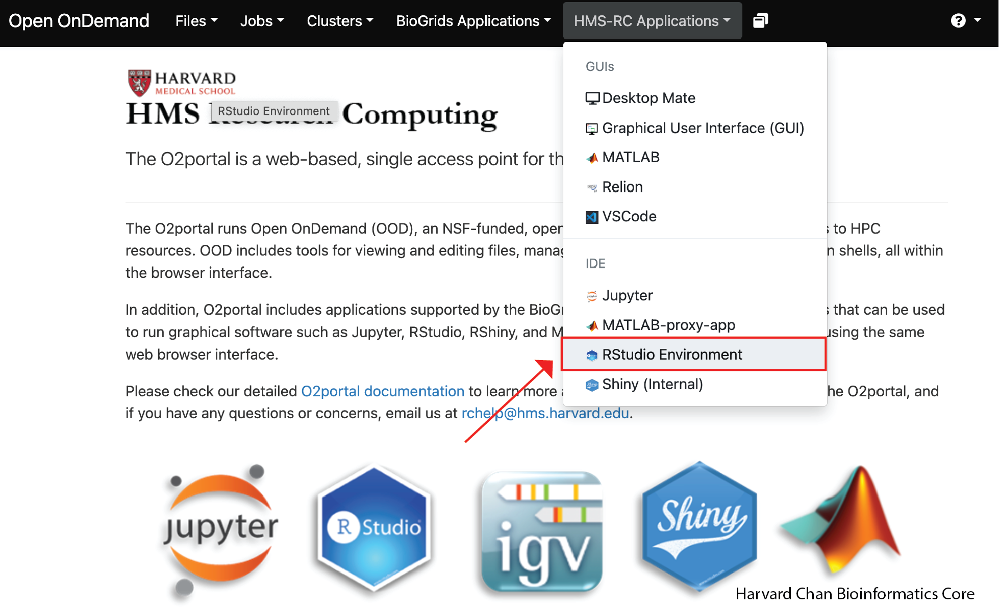
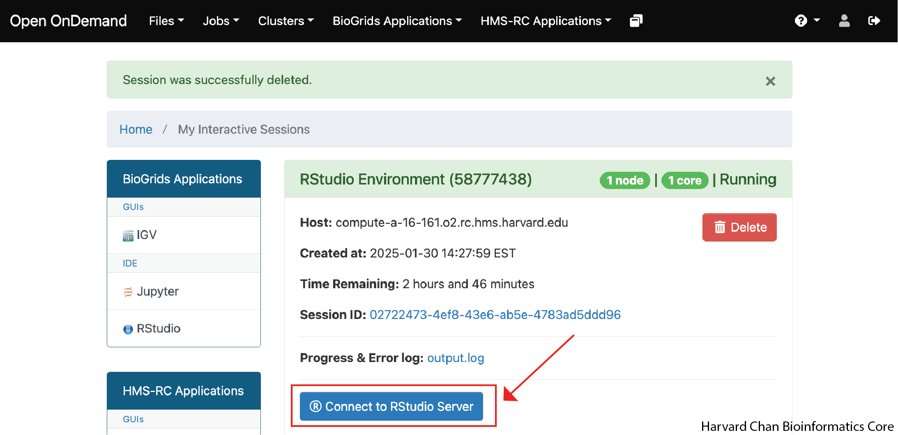

# Welcome to HCBC Platform

Welcome to our Platform guidelines web-page. Here analysts and developers will find guidelines on how to work with our most common environments.

We are developing platforms for each analysis type we have experience with at HCBC.

Most analyses will follow the similar trajectory for set-up. We will note where the trajectories diverge with tables where you will select the appropriate analysis.

## Set up the package

<details>
  <summary>O2 instructions- Click to expand!</summary>

Log onto O2 via the command line and check two things (first-time only): 

   * Remove `bcbio` from you `PATH` by commenting the line in your `.bashrc` if you have it
   * Remove any path you load using the R env variables that could be in your `.Rprofile` or `.bashrc`

Go to the [O2 Portal](https://o2portal.rc.hms.harvard.edu/) and select `HMS-RC Application`, then `RStudio Environment`
<p align="center"></p>

Start Rstudio with using your desired partition, memory, core and time directives. Add the modules you use when using sbatch "Modules to be loaded". This is an example:
  ```
  git/2.9.5  gcc/9.2.0 imageMagick/7.1.0 geos/3.10.2 cmake/3.22.2 R/4.3.1 fftw/3.3.10 gdal/3.1.4 udunits/2.2.28  boost/1.75.0
  ```
   Click "Launch"

<p align="center"></p>

Open RStudio by clicking on the "Connect to RStudio Server"

<p align="center"></p>

When the session is started, make sure you have `bcbioR` installed.

</details>

</p>
Next, load `bcbioR` with:

```
library(bcbioR)
```

Check the package version of `bcbioR` using:

```
packageVersion("bcbioR")
```

Make sure the version is **0.4.*** or later.

<p align="center"></p>

> Note: If you are working in your local environment, install `bcbioR` with
> ```
> devtools::install_github("bcbio/bcbioR",build_manual = TRUE, build_vignettes = TRUE)
> ``` 

## General Project

Use the app in the dropdown below to use the HBC app to set up a project's name. This name will be used for O2, FAS, GitHub and Dropbox. This name is likely already defined in the Trello card.

<details>
<summary><b>Click here to use the HBC app for naming a project</b></summary>
<p align="center"><iframe src="https://hcbc.connect.hms.harvard.edu/content/8cd62872-0ec9-4905-8920-c745d2375758/" width="800px" height="1000px" data-external="1"></iframe></p>
</details>

This set up needs [bcbioR](https://github.com/bcbio/bcbioR) and [usethis](https://usethis.r-lib.org) packages. If you are working on the O2 Portal you will need to install it. Also, `usethis` is a dependency of `bcbioR`, so if you are working locally it should have come along with the download of `bcbioR`.

### Create the Rstudio project

Assign the path that you will be using as the path for your project to the object `project_path` into the `/n/data1/cores/bcbio/PIs` space on O2:

```
project_path <- "/n/data1/cores/bcbio/PIs/PI_name/lastname_postdoc_rnaseq_human_heart_hbc00000"
```

Now, we will need to create a directory using this path to put our analysis in. If this directory already exists, then you can skip this step. The directory creation can be done with this command:

```
dir.create(project_path)
```

Now, we can open an Rproject for our analysis in this path using:

```
usethis::proj_activate(project_path)
```

## Using the template reports

Many analyses have template reports that you can use. You can use these by using the approriate `bcbioR::bcbio_templates()` command from the table below:

| Type of Analysis | `bcbioR::bcbio_templates()` command |
|:---:|:---|
| Bulk RNA-seq | `bcbioR::bcbio_templates(type="rnaseq", outpath="reports")` |
| Single-cell RNA-seq  | `bcbioR::bcbio_templates(type="singlecell", outpath="reports")` |
| ChIP-Seq  | `bcbioR::bcbio_templates(type="chipseq", outpath="reports")` |
| CellChat | **Under development:** `bcbioR::bcbio_templates(type="singlecell_delux", outpath="reports")` |
| COSMX | `bcbioR::bcbio_templates(type="spatial", outpath="reports")` |
| DNA Methylation | **Under development** |


Once again, let's just double check our version of `bcbioR` to make sure we are using version **0.4.** or later.

```
packageVersion("bcbioR")
```

Now, we will use `bcbioR` to set-up the directory structure that we will be using for our analysis using the following command:

```
bcbioR::bcbio_templates(type="base", outpath=".", org="hcbc")
```
## Using Github

Read full documentation [here](./github.md).

Quick start:

- set this once on each computer `git config --global credential.helper store`
- use this command and follow instruction to connect with GitHub `usethis::create_github_token()`
- use this to create the repository the first time `usethis::use_github(org="hbc",private=TRUE)`
- or clone the repository with `usethis::create_from_github("hbc/project_name")` if it already exists

# Tips for Moving Forward

Now that we've gotten set-up for our project, here are a few last tips to try to make your experience smooth:

- You are welcome to selectively commit and push the parts of these template reports that you would like to have on GitHub.
- Try to avoid editing files directly on GitHub. If you do, it will be important that you `Pull` the repository onto O2 before continuing on with your work on O2. If you forget to do this pull and make commits on O2, you can fix it, but it is beyond the scope of this guide.
- Use the checklist in the `README.md` to help keep track of your progress.

# Note
>These materials have been developed by members of the teaching and platform team at the Harvard Chan Bioinformatics Core (HBC) RRID:SCR_025373. 
